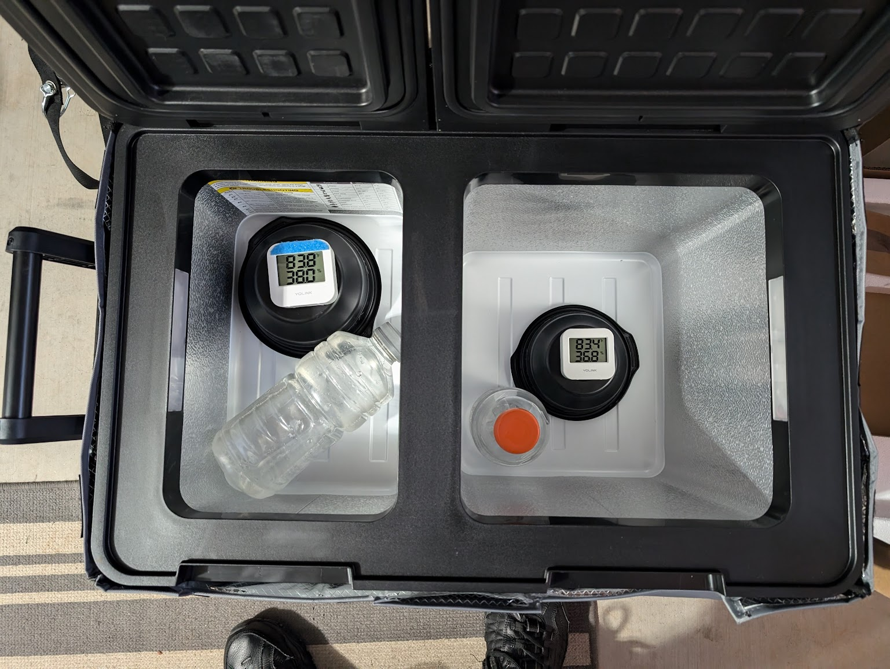
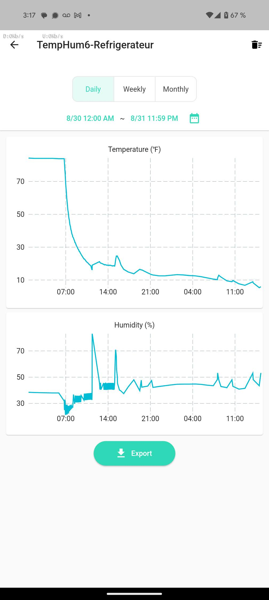
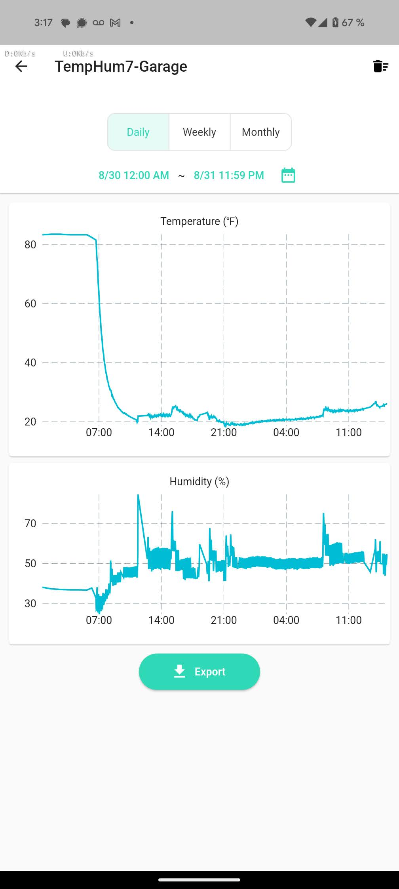

# Links

1. Amazon purchase link: [Setpower PT35 Car Refrigerator with AC Adapter,35L Dual Zone Portable Freezer,12 Volt Refrigerator Electric Cooler for Car camping, RV,Truck,Vehicles,Travel and Home Use,12/24V DC & 110/240V AC,0℉-50℉, $229](https://amzn.to/3Z3fOax)

# Test Notes

I ran tests 30-31+ Aug 2024. 

I had multiple YoLink temp sensors inside the fridge compartments. I set each compartment to 0 deg F and let it run for 1.5 days or so. 

Here is the test setup. I started around 84 degrees after letting the freezer sit upright off for 24 hours first after opening it. I had a water bottle in each side, and the thermometer on top of an empty bowl to keep it off the bottom of the fridge so it would measure actual air temperature, not surface temperature: 

    

When set to **0 deg F**, the left compartment hit a minimum of about **6 deg F** but averaged closer to **10\~15 deg F**. The display on the left compartment would read **5 deg F** when it was actually **10 deg F**, so the display is reading **\~5 deg too low**. 

When set to **0 deg F**, the right compartment hit a minimum of about **19 deg F** but averaged closer to **25 deg F.** The display on the right compartment would read **34 deg F** when it was actually **26 deg F**, so the display is reading **\~8 deg too high**.

Data can be found in the [YoLink_temp_data](YoLink_temp_data) folder.

1. Screenshots from the YoLink app on my phone, showing about 1.5 days of data:

    1. Left compartment over time. Ignore the title:

        

            
        

    1. Right compartment over time. Ignore the title:
    
        

            
        

# My thoughts

1. I am concerned that the temperatures didn't hit 0 deg F, and in the right compartment weren't even close. Is this normal behavior? Or, did I get a defective unit? I don't know. 

1. I am concerned that the display readings are off by so much, especially the right display in my case. Is there a calibration or offset procedure I can apply to make the display more accurate? If there isn't, there should be. 

